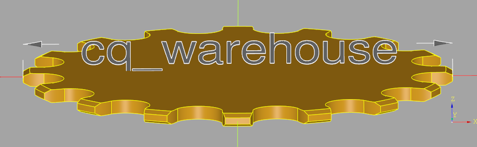
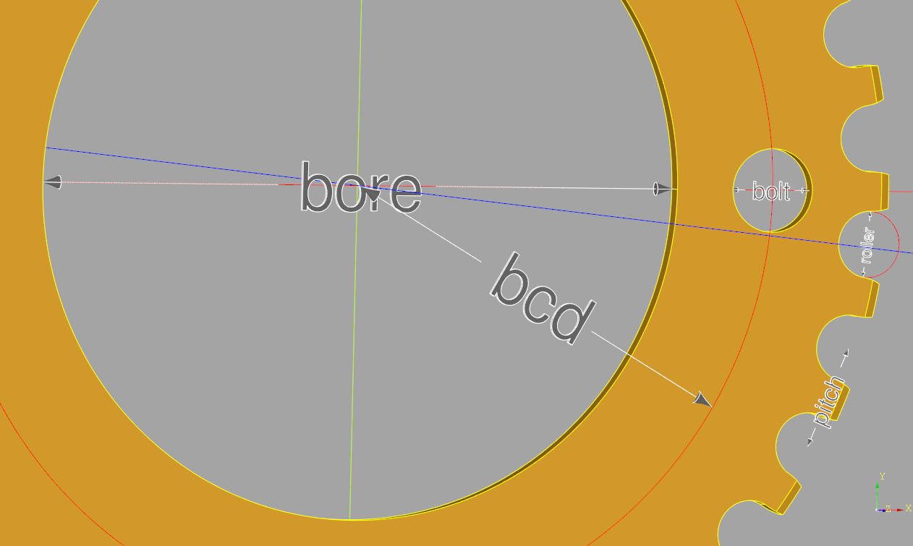
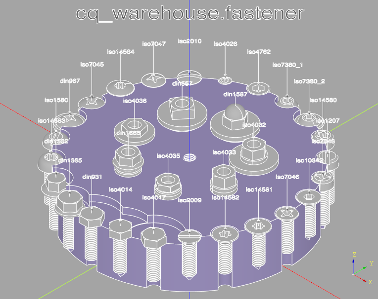
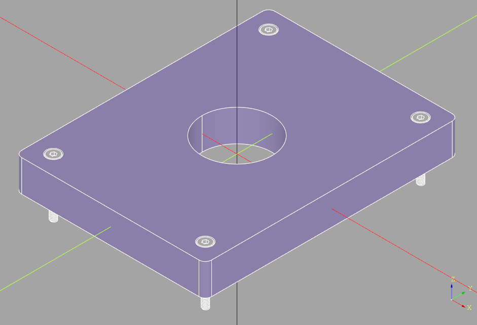
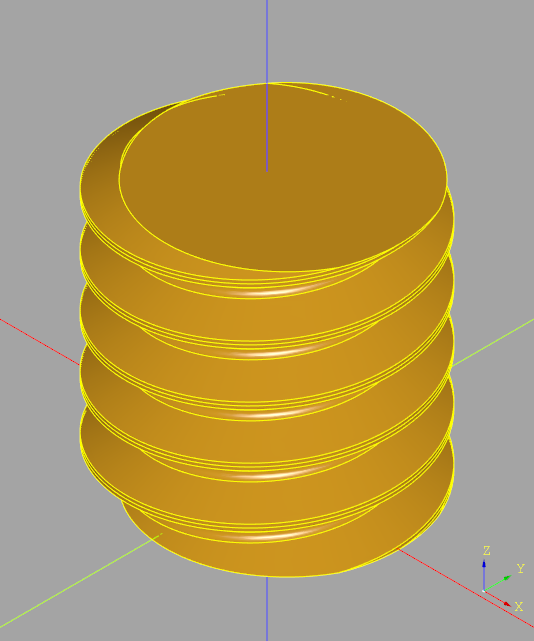

The cq_warehouse python/cadquery package contains a set of parametric parts which can
be customized and used within your projects or saved to a CAD file
in STEP or STL format for use in a wide variety of CAD
or CAM systems.

# Table of Contents
- [Table of Contents](#table-of-contents)
- [Installation](#installation)
- [Package Structure](#package-structure)
  - [sprocket sub-package](#sprocket-sub-package)
    - [Input Parameters](#input-parameters)
    - [Instance Variables](#instance-variables)
    - [Methods](#methods)
    - [Tooth Tip Shape](#tooth-tip-shape)
  - [chain sub-package](#chain-sub-package)
    - [Input Parameters](#input-parameters-1)
    - [Instance Variables](#instance-variables-1)
    - [Methods](#methods-1)
    - [Future Enhancements](#future-enhancements)
  - [drafting sub-package](#drafting-sub-package)
    - [dimension_line](#dimension_line)
    - [extension_line](#extension_line)
    - [callout](#callout)
  - [fastener sub-package](#fastener-sub-package)
    - [Nut](#nut)
      - [Nut Selection](#nut-selection)
      - [Derived Nut Classes](#derived-nut-classes)
    - [Screw](#screw)
      - [Screw Selection](#screw-selection)
      - [Derived Screw Classes](#derived-screw-classes)
    - [Washer](#washer)
      - [Washer Selection](#washer-selection)
      - [Derived Washer Classes](#derived-washer-classes)
    - [Clearance, Tap and Threaded Holes](#clearance-tap-and-threaded-holes)
      - [API](#api)
    - [Thread](#thread)
    - [ExternalThread](#externalthread)
    - [InternalThread](#internalthread)
    - [Extending the fastener sub-package](#extending-the-fastener-sub-package)
  - [extensions sub-package](#extensions-sub-package)
    - [Assembly class extensions](#assembly-class-extensions)
      - [Translate](#translate)
      - [Rotate](#rotate)
    - [Vector class extensions](#vector-class-extensions)
      - [Rotate about X,Y and Z Axis](#rotate-about-xy-and-z-axis)
      - [Map 2D Vector to 3D Vector](#map-2d-vector-to-3d-vector)
    - [Vertex class extensions](#vertex-class-extensions)
      - [Add](#add)
      - [Subtract](#subtract)
      - [Display](#display)
      - [Convert to Vector](#convert-to-vector)
# Installation
Install from github:
```
python3 -m pip install git+https://github.com/gumyr/cq_warehouse.git#egg=cq_warehouse
```
Note that cq_warehouse requires the development version of cadquery (see [Installing CadQuery](https://cadquerytest.readthedocs.io/en/readthedocs/installation.html)). Also note that cq_warehouse uses the pydantic package for input validation which requires keyword arguments (e.g. `num_teeth=16`).
# Package Structure
The cq_warehouse package contains the following sub-packages:
- **sprocket** : a parametric sprocket generator
- **chain**  : a parametric chain generator
- **drafting** : a set of methods used for documenting cadquery objects
- **fastener** : a parametric threaded fastener generator
- **extensions** : a set of enhancements to the core cadquery system

## sprocket sub-package
A sprocket can be generated and saved to a STEP file with just four lines
of python code using the `Sprocket` class:
```python
import cadquery as cq
from cq_warehouse.sprocket import Sprocket

sprocket32 = Sprocket(num_teeth=32)
cq.exporters.export(sprocket32.cq_object,"sprocket.step")
```
How does this code work?
1. The first line imports cadquery CAD system with the alias cq
2. The second line imports the Sprocket class from the sprocket sub-package of the cq_warehouse package
3. The third line instantiates a 32 tooth sprocket named <q>sprocket32</q>
4. The fourth line uses the cadquery exporter functionality to save the generated
sprocket object in STEP format

Note that instead of exporting sprocket32, sprocket32.cq_object is exported as
sprocket32 contains much more than just the raw CAD object - it contains all of
the parameters used to generate this sprocket - such as the chain pitch - and some
derived information that may be useful - such as the chain pitch radius.

### Input Parameters
Most of the Sprocket parameters are shown in the following diagram:



The full set of Sprocket input parameters are as follows:
- `num_teeth` (int) : the number of teeth on the perimeter of the sprocket (must be >= 3)
- `chain_pitch` (float) : the distance between the centers of two adjacent rollers - default 1/2" - (pitch in the diagram)
- `roller_diameter` (float) : the size of the cylindrical rollers within the chain - default 5/16" - (roller in the diagram)
- `clearance` (float) : the size of the gap between the chain's rollers and the sprocket's teeth - default 0.0
- `thickness` (float) : the thickness of the sprocket - default 0.084"
- `bolt_circle_diameter` (float) : the diameter of the mounting bolt hole pattern - default 0.0 - (bcd in the diagram)
- `num_mount_bolts` (int) : the number of bolt holes - default 0 - if 0, no bolt holes are added to the sprocket
- `mount_bolt_diameter` (float) : the size of the bolt holes use to mount the sprocket - default 0.0 - (bolt in the diagram)
- `bore_diameter` (float) : the size of the central hole in the sprocket - default 0.0 - if 0, no bore hole is added to the sprocket (bore in the diagram)

---
**NOTE**
Default parameters are for standard single sprocket bicycle chains.

---
The sprocket in the diagram was generated as follows:
```python
MM = 1
chain_ring = Sprocket(
    num_teeth = 32,
    clearance = 0.1*MM,
    bolt_circle_diameter = 104*MM,
    num_mount_bolts = 4,
    mount_bolt_diameter = 10*MM,
    bore_diameter = 80*MM
)
```
---
**NOTE**
Units in cadquery are defined so that 1 represents one millimeter but `MM = 1` makes this
explicit.

---
### Instance Variables
In addition to all of the input parameters that are stored as instance variables
within the Sprocket instance there are four derived instance variables:
- `pitch_radius` (float) : the radius of the circle formed by the center of the chain rollers
- `outer_radius` (float) : the size of the sprocket from center to tip of the teeth
- `pitch_circumference` (float) : the circumference of the sprocket at the pitch rad
- `cq_object` (cq.Workplane) : the cadquery sprocket object

### Methods
The Sprocket class defines two static methods that may be of use when designing systems with sprockets: calculation of the pitch radius and pitch circumference as follows:
```python
@staticmethod
def sprocket_pitch_radius(num_teeth:int, chain_pitch:float) -> float:
    """
    Calculate and return the pitch radius of a sprocket with the given number of teeth
    and chain pitch

    Parameters
    ----------
    num_teeth : int
        the number of teeth on the perimeter of the sprocket
    chain_pitch : float
        the distance between two adjacent pins in a single link (default 1/2 INCH)
    """

@staticmethod
def sprocket_circumference(num_teeth:int, chain_pitch:float) -> float:
    """
    Calculate and return the pitch circumference of a sprocket with the given number of
    teeth and chain pitch

    Parameters
    ----------
    num_teeth : int
        the number of teeth on the perimeter of the sprocket
    chain_pitch : float
        the distance between two adjacent pins in a single link (default 1/2 INCH)
    """
```
### Tooth Tip Shape
Normally the tip of a sprocket tooth has a circular section spanning the roller pin sockets
on either side of the tooth tip. In this case, the tip is chamfered to allow the chain to
easily slide over the tooth tip thus reducing the chances of derailing the chain in normal
operation. However, it is valid to generate a sprocket without this <q>flat</q> section by
increasing the size of the rollers. In this case, the tooth tips will be <q>spiky</q> and
will not be chamfered.
## chain sub-package
A chain wrapped around a set of sprockets can be generated with the `Chain` class by providing
the size and locations of the sprockets, how the chain wraps and optionally the chain parameters.

For example, one can create the chain for a bicycle with a rear deraileur as follows:
```python
import cadquery as cq
import cq_warehouse.chain as Chain

derailleur_chain = Chain(
    spkt_teeth=[32, 10, 10, 16],
    positive_chain_wrap=[True, True, False, True],
    spkt_locations=[
        (0, 158.9*MM, 50*MM),
        (+190*MM, 0, 50*MM),
        (+190*MM, 78.9*MM, 50*MM),
        (+205*MM, 158.9*MM, 50*MM)
    ]
)
if "show_object" in locals():
    show_object(derailleur_chain.cq_object, name="derailleur_chain")
```
### Input Parameters
The complete set of input parameters are:
- `spkt_teeth` (list of int) : a list of the number of teeth on each sprocket the chain will wrap around
- `spkt_locations` (list of cq.Vector or tuple(x,y) or tuple(x,y,z)) : the location of the sprocket centers
- `positive_chain_wrap` (list of bool) : the direction chain wraps around the sprockets, True for counter clock wise viewed from positive Z
- `chain_pitch` (float) : the distance between two adjacent pins in a single link - default 1/2"
- `roller_diameter` (float) : the size of the cylindrical rollers within the chain - default 5/16"
- `roller_length` (float) : the distance between the inner links, i.e. the length of the link rollers - default 3/32"
- `link_plate_thickness` (float) : the thickness of the link plates (both inner and outer link plates) - default 1mm

The chain is created on the XY plane (methods to move the chain are described below)
with the sprocket centers being described by:
- a two dimensional tuple (x,y)
- a three dimensional tuple (x,y,z) which will result in the chain being created parallel
to the XY plane, offset by <q>z</q>
- the cadquery Vector class which will displace the chain by Vector.z

To control the path of the chain between the sprockets, the user must indicate the desired
direction for the chain to wrap around the sprocket. This is done with the `positive_chain_wrap`
parameter which is a list of boolean values - one for each sprocket - indicating a counter
clock wise or positive angle around the z-axis when viewed from the positive side of the XY
plane. The following diagram illustrates the most complex chain path where the chain
traverses wraps from positive to positive, positive to negative, negative to positive and
negative to negative directions (`positive_chain_wrap` values are shown within the arrows
starting from the largest sprocket):


Note that the chain is perfectly tight as it wraps around the sprockets and does not support any slack. Therefore, as the chain wraps back around to the first link it will either overlap or gap this link - this can be seen in the above figure at the top of the largest sprocket. Adjust the locations of the sprockets to control this value.

### Instance Variables
In addition to all of the input parameters that are stored as instance variables within the Chain instance there are seven derived instance variables:
- `pitch_radii` (list of float) : the radius of the circle formed by the center of the chain rollers on each sprocket
- `chain_links` (float) : the length of the chain in links
- `num_rollers` (int) : the number of link rollers in the entire chain
- `roller_loc` (list of cq.Vector) : the location of each roller in the chain
- `chain_angles` (list of tuple(float,float)) : the chain entry and exit angles in degrees for each sprocket
- `spkt_initial_rotation` (list of float) : angle in degrees to rotate each sprocket in-order to align the teeth with the gaps in the chain
- `cq_object` (cq.Assembly) : the cadquery chain object

### Methods
The Chain class defines two methods:
- a static method used to generate chain links cadquery objects, and
- an instance method that will build a cadquery assembly for a chain given a set of sprocket
cadquery objects.
Note that the make_link instance method uses the @cache decorator to greatly improve the rate at
links can be generated as a chain is composed of many copies of the links.

```python
def assemble_chain_transmission(self,spkts:list[Union[cq.Solid, cq.Workplane]]) -> cq.Assembly:
    """
    Create the transmission assembly from sprockets for a chain

    Parameters
    ----------
    spkts : list of cq.Solid or cq:Workplane
        the sprocket cadquery objects to combine with the chain to build a transmission
    """

@staticmethod
@cache
def make_link(
        chain_pitch:float = 0.5*INCH,
        link_plate_thickness:float = 1*MM,
        inner:bool = True,
        roller_length:float = (3/32)*INCH,
        roller_diameter:float = (5/16)*INCH
    ) -> cq.Workplane:
    """
    Create either inner or outer link pairs.  Inner links include rollers while
    outer links include fake roller pins.

    Parameters
    ----------
    chain_pitch : float = (1/2)*INCH
        # the distance between the centers of two adjacent rollers
    link_plate_thickness : float = 1*MM
        # the thickness of the plates which compose the chain links
    inner : bool = True
        # inner links include rollers while outer links include roller pins
    roller_length : float = (3/32)*INCH,
        # the spacing between the inner link plates
    roller_diameter : float = (5/16)*INCH
        # the size of the cylindrical rollers within the chain
    """
```

Once a chain or complete transmission has been generated it can be re-oriented as follows:
```python
two_sprocket_chain = Chain(
    spkt_teeth = [32, 32],
    positive_chain_wrap = [True, True],
    spkt_locations = [ (-5*INCH, 0), (+5*INCH, 0) ]
)
relocated_transmission = two_sprocket_chain.assemble_chain_transmission(
    spkts = [spkt32.cq_object, spkt32.cq_object]
).rotate(axis=(0,1,1),angle=45).translate((20, 20, 20))
```
### Future Enhancements
Two future enhancements are being considered:
1. Non-planar chains - If the sprocket centers contain `z` values, the chain would follow the path of a spline between the sockets to approximate the path of a bicycle chain where the front and read sprockets are not in the same plane. Currently, the `z` values of the first sprocket define the `z` offset of the entire chain.
2. Sprocket Location Slots - Typically on or more of the sprockets in a chain transmission will be adjustable to allow the chain to be tight around the
sprockets. This could be implemented by allowing the user to specify a pair
of locations defining a slot for a given sprocket indicating that the sprocket
location should be selected somewhere along this slot to create a perfectly
fitting chain.
## drafting sub-package
A class used to document cadquery designs by providing three methods that create objects that can be included into the design illustrating marked dimension_lines or notes.

For example:
```python
import cadquery as cq
from cq_warehouse.drafting import Draft

# Import an object to be dimensioned
mystery_object = cq.importers.importStep("mystery.step")

# Create drawing instance with appropriate settings
metric_drawing = Draft(decimal_precision=1)

# Create an extension line from corners of the part
length_dimension_line = metric_drawing.extension_line(
    object_edge=mystery_object.faces("<Z").vertices("<Y").vals(),
    offset=10.0,
    tolerance=(+0.2, -0.1),
)

if "show_object" in locals():
    show_object(mystery_object, name="mystery_object")
    show_object(length_dimension_line, name="length_dimension_line")

```
To illustrate some of the capabilities of the drafting package, a set of dimension lines, extension lines and callouts were applied to a cadquery part with no prior knowledge of any of the dimensions:

One could define three instances of the Draft class, one for each of the XY, XZ and YZ planes and generate a set of dimensions on each one. By enabling one of these planes at a time and exporting svg images traditional drafting documents can be generated.

When generating dimension lines there are three possibilities depending on the measurement and Draft attributes (described below):
1. The label text (possibly including units and tolerances) and arrows fit within the measurement,
2. The label text but not the arrows fit within the measurement, or
3. Neither the text nor the arrows fit within the measurements.
Cases 1 and 2 are shown in the above example. In case 3, the label will be attached to one of the external arrows.

These three possibilities are illustrated below with both linear and arc extension lines:

Note that type 3b can only be created by disabling the end arrow - see the arrows parameter below.

The Draft class contains a set of attributes used to describe subsequent dimension_line(s), extension_line(s) or callout(s). The full list is as follows:

- `font_size` (float = 5.0) : the size of the text in dimension lines and callouts
- `color` (Optional[cq.Color]) : the color of text, extension lines and arrows (defaults to (0.25, 0.25, 0.25))
- `arrow_diameter` (float = 1.0) : the maximum diameter of the conical arrows - note that if a dimension line follows the provided path even if it's non-linear
- `arrow_length` (float = 3.0) : arrow head length
- `label_normal` (Optional[VectorLike]) : text and extension line plane normal - default to XY plane
- `units` (Literal["metric", "imperial"]) : unit of measurement - default "metric"
- `number_display` (Literal["decimal", "fraction"]) : display numbers as decimals or fractions - defaults to "decimal"
- `display_units` (bool) : control the display of units with numbers - default to True
- `decimal_precision` (int = 2) : number of decimal places when displaying numbers
- `fractional_precision` (int = 64) : maximum fraction denominator - note it must be a factor of 2

The three public methods that the Draft class defines are described below. Note that both dimension_line ane extension_line support arcs as well as linear measurements - to be exact, the shown measurement is the length of the input path or object edge which could be an arbitrary shape like a spline. If this path or object_edge is part of a circle the size of the arc in degrees may be displayed instead of the length.

### dimension_line
Typically used for (but not restricted to) inside dimensions, a dimension line often as arrows on either side of a dimension or label. The full set of input parameters are as follows:
- `path` (PathDescriptor) : a very general type of input used to describe the path the dimension line will follow where `PathDescriptor = Union[
cq.Wire, cq.Edge, list[Union[cq.Vector, cq.Vertex, Tuple[float, float, float]]]` - i.e. a list of points or cadquery edge or wire either extracted from a part or created by the user.
- `label` (Optional[str]) : a text string which will replace the length (or arc length) that would otherwise be extracted from the provided path. Providing a label is useful when illustrating a parameterized input where the name of an argument is desired not an actual measurement.
- `arrows` (Tuple[bool,bool]) : a pair of boolean values controlling the placement of the start and end arrows - both default to True.
- `tolerance` (Optional[Union[float,Tuple[float,float]]]) : an optional tolerance value to add to the extracted length value. If a single tolerance value is provided it is shown as ± the provided value while a pair of values are shown as separate + and - values.
- `label_angle` (bool) : a flag - defaulting to False - indicating that instead of an extracted length value, the size of the circular arc extracted from the path should be displayed in degrees.

dimension_line returns a cadquery `Assembly` object.

### extension_line
Typically used for (but not restricted to) outside dimensions, with a pair of lines extending from the edge of a part to a dimension line. The full set of input parameters are as follows:
- `object_edge` (PathDescriptor) : a very general type of input defining the object to be dimensioned. Typically this value would be extracted from the part but is not restricted to this use.
- `offset` (float) : a distance to displace the dimension line from the edge of the object.
- `label` (Optional[str]) : a text string which will replace the length (or arc length) that would otherwise be extracted from the provided path. Providing a label is useful when illustrating a parameterized input where the name of an argument is desired not an actual measurement.
- `arrows` (Tuple[bool,bool]) : a pair of boolean values controlling the placement of the start and end arrows - both default to True.
- `tolerance` (Optional[Union[float,Tuple[float,float]]]) : an optional tolerance value to add to the extracted length value. If a single tolerance value is provided it is shown as ± the provided value while a pair of values are shown as separate + and - values.
- `label_angle` (bool) : a flag - defaulting to False - indicating that instead of an extracted length value, the size of the circular arc extracted from the path should be displayed in degrees.

extension_line returns a cadquery `Assembly` object.

### callout
A text box with or without a tail pointing to another object used to provide extra information to the reader. The full set of input parameters are as follows:
- `label` (str) : the text to place within the callout - note that including a `\n` in the text string will split the text over multiple lines.
- `tail` (Optional[PathDescriptor]) : an optional tail defined as above - note that if provided the text origin will be the start of the tail.
- `origin` (Optional[PointDescriptor]) : a very general definition of anchor point of the text defined as `PointDescriptor = Union[cq.Vector, cq.Vertex, Tuple[float, float, float]]`
- `justify` (Literal["left", "center", "right"]) : text alignment which defaults to "left"

callout returns a cadquery `Assembly` object.

## fastener sub-package
Many mechanical designs will contain threaded fasteners of some kind, either in a threaded hole or threaded screws or bolts holding two or more parts together. The fastener sub-package provides a set of classes with which raw threads can be created such that they can be integrated into other parts as well as a set of classes that create many different types of nuts, screws and washers - as follows:


The holes for the screws in this figure were created with an extension of the Workplane class `clearanceHole`, the nuts `tapHole` and the central hole `threadedHole`. The washers were automatically placed and all components were add to an Assembly in their correct position and orientations - see [Clearance, Tap and Threaded Holes](#clearance-tap-and-threaded-holes) for details.

Here is a list of the classes (and fastener types) provided:
- [Nut](#nut) - the base nut class
  - `DomedCapNut`: din1587
  - `HexNut`: iso4033, iso4035, iso4032
  - `HexNutWithFlange`: din1665
  - `UnchamferedHexagonNut`: iso4036
  - `SquareNut`: din557
- [Screw](#screw) - the base screw class
  - `ButtonHeadScrew`: iso7380_1
  - `ButtonHeadWithCollarScrew`: iso7380_2
  - `CheeseHeadScrew`: iso14580, iso7048, iso1207
  - `CounterSunkScrew`: iso2009, iso14582, iso14581, iso10642, iso7046
  - `HexHeadScrew`: iso4017, din931, iso4014
  - `HexHeadWithFlangeScrew`: din1662, din1665
  - `PanHeadScrew`: asme_b_18.6.3, iso1580, iso14583
  - `PanHeadWithCollarScrew`: din967
  - `RaisedCheeseHeadScrew`: iso7045
  - `RaisedCounterSunkOvalHeadScrew`: iso2010, iso7047, iso14584
  - `SetScrew`: iso4026
  - `SocketHeadCapScrew`: iso4762, asme_b18.3
- [Washer](#washer) - the base washer class
  - `PlainWasher`: iso7094, iso7093, iso7089, iso7091
  - `ChamferedWasher`: iso7090
  - `CheeseHeadWasher`: iso7092
- [Thread](#thread) - the base thread class
  - [ExternalThread](#externalthread) - a derived class providing threads on screws
  - [InternalThread](#internalthread) - a derived class providing threads on nuts

See [Extending the fastener sub-package](#Extending-the-fastener-sub-package) for guidance on how to easily add new sizes or entirely new types of fasteners.

 The following example creates a variety of different sized fasteners:
```python
import cadquery as cq
from cq_warehouse.fastener import HexNut, SocketHeadCapScrew, SetScrew
MM = 1
IN = 25.4 * MM

nut = HexNut(size="M3-0.5", fastener_type="iso4032")
setscrew = SetScrew(size="M6-1", fastener_type="iso4026",length=10 * MM)
capscrew = SocketHeadCapScrew(size="#6-32", fastener_type="asme_b18.3", length=(1/2) * IN)
```
Both metric and imperial sized standard fasteners are directly supported by the fastener sub-package although the majority of the fasteners currently implemented are metric.

Many of the fastener standards provide ranges for some of the dimensions - for example a minimum and maximum head diameter. This sub-package generally uses the maximum sizes when a range is available in-order to ensure clearance between a fastener and another part won't be compromised by a physical part that is within specification but larger than the CAD model.

Threaded parts are complex for CAD systems to create and significantly increase the storage requirements thus making the system slow and difficult to use. To minimize these requirements all of the fastener classes have a `simple` boolean parameter that when `True` doesn't create actual threads at all. Such simple parts have the same overall dimensions and such that they can be used to check for fitment without dramatically impacting performance.

> :warning: **CQ-editor** :warning: Set the Preferences :arrow_right: 3D Viewer :arrow_right: Deviation parameter to 0.01 to avoid crashes due to memory over-consumption when working with threads

All of the fasteners default to right-handed thread but each of them provide a `hand` string parameter which can either be `"right"` or `"left"`.

All of the fastener classes provide a `cq_object` instance variable which contains the cadquery object.

The following sections describe each of the provided classes.

### Nut
As the base class of all other nut and bolt classes, all of the derived nut classes share the same interface as follows:
- `fastener_type` (str) : type identifier - e.g. `"iso4032"`
- `size` (str) : standard sizes - e.g. `"M6-1"`
- `hand` (Literal["right", "left"] = "right") : thread direction
- `simple` (bool = True) : simplify thread

Each nut instance creates a set of properties that provide the CAD object as well as valuable parameters, as follows (values intended for internal use are not shown):

- `clearance_drill_sizes` - see [Clearance, Tap and Threaded Holes](#clearance-tap-and-threaded-holes)
- `clearance_hole_diameters` - see [Clearance, Tap and Threaded Holes](#clearance-tap-and-threaded-holes)
- `cq_object` (cq.Compound) : cadquery Compound object
- `nut_diameter` (float) : maximum diameter of the nut
- `nut_thickness` (float) : maximum thickness of the nut
- `nut_class` - (str) : display friendly class name
- `tap_drill_sizes` - [Clearance, Tap and Threaded Holes](#clearance-tap-and-threaded-holes)
- `tap_hole_diameters` - [Clearance, Tap and Threaded Holes](#clearance-tap-and-threaded-holes)

#### Nut Selection
As there are many classes and types of nuts to select from, the Nut class provides some methods that can help find the correct nut for your application. As a reminder, to find the subclasses of the Nut class, use `__subclasses__()`:
```python
Nut.__subclasses__()  # [<class 'cq_warehouse.fastener.DomedCapNut'>, ...]
```
Here is a summary of the class methods:
- `types()` : (set{str}) - create a set of nut types, e.g.:
```python
HexNut.types() # {'iso4033', 'iso4032', 'iso4035'}
```
- `sizes(fastener_type:str)` : (list[str]) - create a list of nut sizes, e.g.:
```python
HexNut.sizes("iso4033") # ['M1.6-0.35', 'M1.8-0.35', 'M2-0.4', 'M2.5-0.45', 'M3-0.45', 'M3.5-0.6', 'M4-0.7', 'M5-0.8', 'M6-1', 'M8-1.25', 'M10-1.5', 'M12-1.75', 'M14-2', 'M16-2', 'M18-2.5', 'M20-2.5', 'M22-2.5', 'M24-3', 'M27-3', 'M30-3.5', 'M33-3.5', 'M36-4', 'M39-4', 'M42-4.5', 'M45-4.5', 'M48-5', 'M52-5']
```
- `select_by_size(size:str)` : (dict{class:[type,...],} - e.g.:
```python
Nut.select_by_size("M6-1") # {<class 'cq_warehouse.fastener.DomedCapNut'>: ['din1587'], <class 'cq_warehouse.fastener.HexNut'>: ['iso4035', 'iso4032', 'iso4033'], <class 'cq_warehouse.fastener.HexNutWithFlange'>: ['din1665'], <class 'cq_warehouse.fastener.UnchamferedHexagonNut'>: ['iso4036'], <class 'cq_warehouse.fastener.SquareNut'>: ['din557']}
```
#### Derived Nut Classes
The following is a list of the current nut classes derived from the base Nut class. Also listed is the type for each of these derived classes where the type refers to a standard that defines the nut parameters. All derived nuts inherit the same API as the base Nut class.
- `DomedCapNut`: din1587
- `HexNut`: iso4033, iso4035, iso4032
- `HexNutWithFlange`: din1665
- `UnchamferedHexagonNut`: iso4036
- `SquareNut`: din557

Detailed information about any of the nut types can be readily found on the internet from manufacture's websites or from the standard document itself.
### Screw
As the base class of all other screw and bolt classes, all of the derived screw classes share the same interface as follows:
- `fastener_type` (str) : type identifier - e.g. `"iso4014"`
- `size` (str) : standard sizes - e.g. `"M6-1"`
- `length` (float) : distance from base of head to tip of thread
- `hand` (Literal["right", "left"] = "right") : thread direction
- `simple` (bool = True) : simplify thread

In addition, to allow screws that have no recess (e.g. hex head bolts) to be countersunk the gap around the hex head which allows a socket wrench to be inserted can be specified with:
- `socket_clearance` (float = 6 * MM)

Each screw instance creates a set of properties that provide the Compound CAD object as well as valuable parameters, as follows (values intended for internal use are not shown):

- `clearance_drill_sizes` - see [Clearance, Tap and Threaded Holes](#clearance-tap-and-threaded-holes)
- `clearance_hole_diameters` - see [Clearance, Tap and Threaded Holes](#clearance-tap-and-threaded-holes)
- `cq_object` (cq.Compound) : cadquery Compound object
- `head_diameter` (float) : maximum diameter of the head
- `head_height` (float) : maximum height of the head
- `nominal_lengths` (list[float]) : nominal lengths values
- `screw_class` - (str) : display friendly class name
- `tap_drill_sizes` - [Clearance, Tap and Threaded Holes](#clearance-tap-and-threaded-holes)
- `tap_hole_diameters` - [Clearance, Tap and Threaded Holes](#clearance-tap-and-threaded-holes)

The following method helps with hole creation:

- `min_hole_depth(counter_sunk: bool = True)`  : distance from surface to tip of screw

#### Screw Selection
As there are many classes and types of screws to select from, the Screw class provides some methods that can help find the correct screw for your application. As a reminder, to find the subclasses of the Screw class, use `__subclasses__()`:
```python
Screw.__subclasses__()  # [<class 'cq_warehouse.fastener.ButtonHeadScrew'>, ...]
```
Here is a summary of the class methods:
- `types()` : (set{str}) - create a set of screw types, e.g.:
```python
CounterSunkScrew.types() # {'iso14582', 'iso10642', 'iso14581', 'iso2009', 'iso7046'}
```
- `sizes(fastener_type:str)` : (list[str]) - create a list of screw sizes, e.g.:
```python
CounterSunkScrew.sizes("iso7046") # ['M1.6-0.35', 'M2-0.4', 'M2.5-0.45', 'M3-0.5', 'M3.5-0.6', 'M4-0.7', 'M5-0.8', 'M6-1', 'M8-1.25', 'M10-1.5']
```
- `select_by_size(size:str)` : (dict{class:[type,...],} - e.g.:
```python
Screw.select_by_size("M6-1") # {<class 'cq_warehouse.fastener.ButtonHeadScrew'>: ['iso7380_1'], <class 'cq_warehouse.fastener.ButtonHeadWithCollarScrew'>: ['iso7380_2'], ...}
```
To see if a given screw type has screws in the length you are looking for, each screw class provides a dictionary of available lengths, as follows:
- `nominal_length_range[fastener_type:str]` : (list[float]) - all the nominal lengths for this screw type, e.g.:
```python
CounterSunkScrew.nominal_length_range["iso7046"] # [3.0, 4.0, 5.0, 6.0, 8.0, 10.0, 12.0, 14.0, 16.0, 20.0, 25.0, 30.0, 35.0, 40.0, 45.0, 50.0, 55.0, 60.0]
```
During instantiation of a screw any value of `length` may be used; however, only a subset of the above nominal_length_range is valid for any given screw size. The valid sub-range is given with the `nominal_lengths` property as follows:
```python
screw = CounterSunkScrew(fastener_type="iso7046",size="M6-1",length=12*MM)
screw.nominal_lengths # [8.0, 10.0, 12.0, 14.0, 16.0, 20.0, 25.0, 30.0, 35.0, 40.0, 45.0, 50.0, 55.0, 60.0]
```
#### Derived Screw Classes
The following is a list of the current screw classes derived from the base Screw class. Also listed is the type for each of these derived classes where the type refers to a standard that defines the screw parameters. All derived screws inherit the same API as the base Screw class.
- `ButtonHeadScrew`: iso7380_1
- `ButtonHeadWithCollarScrew`: iso7380_2
- `CheeseHeadScrew`: iso14580, iso7048, iso1207
- `CounterSunkScrew`: iso2009, iso14582, iso14581, iso10642, iso7046
- `HexHeadScrew`: iso4017, din931, iso4014
- `HexHeadWithFlangeScrew`: din1662, din1665
- `PanHeadScrew`: asme_b_18.6.3, iso1580, iso14583
- `PanHeadWithCollarScrew`: din967
- `RaisedCheeseHeadScrew`: iso7045
- `RaisedCounterSunkOvalHeadScrew`: iso2010, iso7047, iso14584
- `SetScrew`: iso4026
- `SocketHeadCapScrew`: iso4762, asme_b18.3

Detailed information about any of the screw types can be readily found on the internet from manufacture's websites or from the standard document itself.
### Washer
As the base class of all other washer and bolt classes, all of the derived washer classes share the same interface as follows:
- `fastener_type` (str) : type identifier - e.g. `"iso4032"`
- `size` (str) : standard sizes - e.g. `"M6-1"`

Each washer instance creates a set of properties that provide the Compound CAD object as well as valuable parameters, as follows (values intended for internal use are not shown):

- `clearance_drill_sizes` - see [Clearance, Tap and Threaded Holes](#clearance-tap-and-threaded-holes)
- `clearance_hole_diameters` - see [Clearance, Tap and Threaded Holes](#clearance-tap-and-threaded-holes)
- `cq_object` (cq.Compound) : cadquery Compound object
- `washer_diameter` (float) : maximum diameter of the washer
- `washer_thickness` (float) : maximum thickness of the washer
- `washer_class` - (str) : display friendly class name

#### Washer Selection
As there are many classes and types of washers to select from, the Washer class provides some methods that can help find the correct washer for your application. As a reminder, to find the subclasses of the Washer class, use `__subclasses__()`:
```python
Washer.__subclasses__()  # [<class 'cq_warehouse.fastener.PlainWasher'>, <class 'cq_warehouse.fastener.ChamferedWasher'>, <class 'cq_warehouse.fastener.CheeseHeadWasher'>]
```
Here is a summary of the class methods:
- `types()` : (set{str}) - create a set of washer types, e.g.:
```python
PlainWasher.types() # {'iso7091', 'iso7089', 'iso7093', 'iso7094'}
```
- `sizes(fastener_type:str)` : (list[str]) - create a list of washer sizes, e.g.:
```python
PlainWasher.sizes("iso7091") # ['M1.6', 'M1.7', 'M2', 'M2.3', 'M2.5', 'M2.6', 'M3', 'M3.5', 'M4', 'M5', 'M6', 'M7', 'M8', 'M10', 'M12', 'M14', 'M16', 'M18', 'M20', 'M22', 'M24', 'M26', 'M27', 'M28', 'M30', 'M32', 'M33', 'M35', 'M36']
```
- `select_by_size(size:str)` : (dict{class:[type,...],} - e.g.:
```python
Washer.select_by_size("M6") # {<class 'cq_warehouse.fastener.PlainWasher'>: ['iso7094', 'iso7093', 'iso7089', 'iso7091'], <class 'cq_warehouse.fastener.ChamferedWasher'>: ['iso7090'], <class 'cq_warehouse.fastener.CheeseHeadWasher'>: ['iso7092']}
```

#### Derived Washer Classes
The following is a list of the current washer classes derived from the base Washer class. Also listed is the type for each of these derived classes where the type refers to a standard that defines the washer parameters. All derived washers inherit the same API as the base Washer class.
- `PlainWasher`: iso7094, iso7093, iso7089, iso7091
- `ChamferedWasher`: iso7090
- `CheeseHeadWasher`: iso7092

Detailed information about any of the washer types can be readily found on the internet from manufacture's websites or from the standard document itself.

### Clearance, Tap and Threaded Holes
When designing parts with CadQuery a common operation is to place holes appropriate to a specific fastener into the part. This operation is optimized with cq_warehouse by the following three new Workplane methods:
- `cq.Workplane.clearanceHole`,
- `cq.Workplane.tapHole`, and
- `cq.Workplane.threadedHole`.

These methods use data provided by a fastener instance (either a `Nut` or a `Screw`) to both create the appropriate hole (possibly countersunk) in your part as well as add the fastener to a CadQuery Assembly in the location of the hole. In addition, a list of washers can be provided which will get placed under the head of the screw or nut in the provided Assembly.

For example, let's re-build the parametric bearing pillow block found in the [CadQuery Quickstart](https://cadquerytest.readthedocs.io/en/readthedocs/quickstart.html):
```python
import cadquery as cq
from cq_warehouse.fastener import SocketHeadCapScrew

height = 60.0
width = 80.0
thickness = 10.0
diameter = 22.0
padding = 12.0

# make the screw
screw = SocketHeadCapScrew(fastener_type="iso4762", size="M2-0.4", length=16, simple=False)
# make the assembly
pillow_block = cq.Assembly(None, name="pillow_block")
# make the base
base = (
    cq.Workplane("XY")
    .box(height, width, thickness)
    .faces(">Z")
    .workplane()
    .hole(diameter)
    .faces(">Z")
    .workplane()
    .rect(height - padding, width - padding, forConstruction=True)
    .vertices()
    .clearanceHole(fastener=screw, baseAssembly=pillow_block)
    .edges("|Z")
    .fillet(2.0)
)
pillow_block.add(base)
# Render the assembly
show_object(pillow_block)
```
Which results in:

The differences between this code and the Read the Docs version are:
- screw dimensions aren't required
- the screw is created during instantiation of the `SocketHeadCapScrew` class
- an assembly is created and later the base is added to that assembly
- the call to cskHole is replaced with clearanceHole

Not only were the appropriate holes for M2-0.4 screws created but an assembly was created to store all of the parts in this project all without having to research the dimensions of M2 screws.

Note: In this example the `simple=False` parameter creates accurate threads on each of the screws which significantly increases the complexity of the model. The default of simple is True which models the thread as a simple cylinder which is sufficient for most applications without the performance cost of accurate threads. Also note that the default color of the pillow block "base" was changed to better contrast the screws.
#### API
The APIs of these three methods are:

`clearanceHole`: A hole that allows the screw to be inserted freely
- `fastener`: Union[Nut, Screw],
- `washers`: Optional[List[Washer]] = None,
- `fit`: Optional[Literal["Close", "Normal", "Loose"]] = "Normal",
- `depth`: Optional[float] = None,
- `counterSunk`: Optional[bool] = True,
- `baseAssembly`: Optional[cq.Assembly] = None,
- `clean`: Optional[bool] = True,

`tapHole`: A hole ready for a tap to cut a thread
- `fastener`: Union[Nut, Screw],
- `washers`: Optional[List[Washer]] = None,
- `material`: Optional[Literal["Soft", "Hard"]] = "Soft",
- `depth`: Optional[float] = None,
- `counterSunk`: Optional[bool] = True,
- `fit`: Optional[Literal["Close", "Normal", "Loose"]] = "Normal",
- `baseAssembly`: Optional[cq.Assembly] = None,
- `clean`: Optional[bool] = True,

`threadedHole`: A hole with a integral thread
- `fastener`: Screw,
- `depth`: float,
- `washers`: List[Washer],
- `hand`: Literal["right", "left"] = "right",
- `simple`: Optional[bool] = False,
- `counterSunk`: Optional[bool] = True,
- `fit`: Optional[Literal["Close", "Normal", "Loose"]] = "Normal",
- `baseAssembly`: Optional[cq.Assembly] = None,
- `clean`: Optional[bool] = True,

One can see, the API for all three methods are very similar. The `fit` parameter is used for clearance hole dimensions and to calculate the gap around the head of a countersunk screw. The `material` parameter controls the size of the tap hole as they differ as a function of the material the part is made of. For clearance and tap holes, `depth` values of `None` are treated as thru holes. The threaded hole method requires that `depth` be specified as a consequence of how the thread is constructed.

The data used in the creation of these holes is available via three instance methods:
```python
screw = CounterSunkScrew(fastener_type="iso7046", size="M6-1", length=10)
screw.clearance_hole_diameters # {'Close': 6.4, 'Normal': 6.6, 'Loose': 7.0}

screw.clearance_drill_sizes # {'Close': '6.4', 'Normal': '6.6', 'Loose': '7'}
screw.tap_hole_diameters # {'Soft': 5.0, 'Hard': 5.4}
screw.tap_drill_sizes # {'Soft': '5', 'Hard': '5.4'}
```
Note that with imperial sized holes (e.g. 7/16), the drill sizes could be a fractional size (e.g. 25/64) or a numbered or lettered size (e.g. U). This information can be added to your designs with the [drafting sub-package](#drafting-sub-package).

### Thread
As the base class of the other thread classes it isn't intended for end users. Both external and internal threads are ISO standard by default as shown in the following diagram (from https://en.wikipedia.org/wiki/ISO_metric_screw_thread):


All thread objects are complex and therefore can be difficult for the OCCT core to work with. To aid in this both the internal and external thread objects are created such that they can be combined with the `glue` option of the `union()` method, as such:
```python
    ...
    return self.head.union(self.shank, glue=True).val()
```
Other build techniques, such as using the `cut()` method to remove an internal thread from an object, often fail or take an excessive amount of time.
### ExternalThread


This derived class of Thread creates an external thread object as found on screws and bolts. The parameters are:
- `major_diameter` (float)
- `pitch` (float)
- `length` (float)
- `hand` (Literal["right", "left"] = "right")
- `hollow` (bool = False) : hollow out the center of the thread object to optimize inclusion of internal detail
- `thread_angle` (Optional[float] = 60.0)
- `simple` (bool = False) : simplify thread

This class exposes instance variables for the input parameters as well as:
- `h_parameter` (float) : the value of `h` as shown in the thread diagram
- `min_radius` (float) : inside radius of the thread diagram
- `thread_radius` (float) : thread radius of the thread diagram
- `cq_object` (cq.Solid) : cadquery Solid object

### InternalThread


This derived class of Thread creates an internal thread object as found on nuts. This object looks like a washer with the thread cut into the inside of the object such that it can be efficiently included into another object by placing it into an appropriately sized hole. The parameters are:
- `major_diameter` (float)
- `pitch` (float)
- `length` (float)
- `hand` (Literal["right", "left"] = "right")
- `thread_angle` (Optional[float] = 60.0)
- `simple` (bool = False) : simplify thread

This class exposes instance variables for the input parameters as well as:
- `h_parameter` (float) : the value of `h` as shown in the thread diagram
- `min_radius` (float) : inside radius of the thread diagram
- `thread_radius` (float) : thread radius of the thread diagram
- `internal_thread_socket_radius` (float) : the outer radius of the thread object - (e.g. the size to make the hole for it to fit into)
- `cq_object` (cq.Solid) : cadquery Solid object
### Extending the fastener sub-package
The fastener sub-package has been designed to be extended in the following two ways:
- **Alternate Sizes** - As mentioned previously, the data used to guide the creation of fastener objects is derived from `.csv` files found in the same place as the source code. One can add to the set of standard sized fasteners by inserting appropriate data into the tables. There is a table for each fastener class; an example of the 'socket_head_cap_parameters.csv' is below:

| Size      | iso4762:dk | iso4762:k | ... | asme_b18.3:dk | asme_b18.3:k | asme_b18.3:s |
| --------- | ---------- | --------- | --- | ------------- | ------------ | ------------ |
| M1.6-0.35 | 3.14       | 1.6       |
| M2-0.4    | 3.98       | 2         |
| M2.5-0.45 | 4.68       | 2.5       |
| M3-0.5    | 5.68       | 3         |
| ...       |
| #0-80     |            |           |     | 0.096         | 0.06         | 0.05         |
| #1-64     |            |           |     | 0.118         | 0.073        | 1/16         |
| #1-72     |            |           |     | 0.118         | 0.073        | 1/16         |
| #2-56     |            |           |     | 0.14          | 0.086        | 5/64         |

The first row must contain a 'Size' and a set of '{fastener_type}:{parameter}' values. The parameters are taken from the ISO standards where 'k' represents the head height of a screw head, 'dk' is represents the head diameter, etc. Refer to the appropriate document for a complete description. The fastener 'Size' field has the format 'M{thread major diameter}-{thread pitch}' for metric fasteners or either '#{guage}-{TPI}' or '{fractional major diameter}-{TPI}' for imperial fasteners (TPI refers to Threads Per Inch). All the data for imperial fasteners must be entered as inch dimensions while metric data is in millimeters.

There is also a 'nominal_screw_lengths.csv' file that contains a list of all the lengths supported by the standard, as follows:

| Screw_Type | Unit | Nominal_Sizes            |
| ---------- | ---- | ------------------------ |
| din931     | mm   | 30,35,40,45,50,55,60,... |
| ...        |      |                          |

The 'short' and 'long' values from the first table (not shown) control the minimum and maximum values in the nominal length ranges for each screw.

- **New Fastener Types** - The base/derived class structure was designed to allow the creation of new fastener types/classes. For new fastener classes a 2D drawing of one half of the fastener profile is required. If the fastener has a non circular plan (e.g. a hex or a square) a 2D drawing of the plan is required. If the fastener contains a flange and a plan, a 2D profile of the flange is required. If these profiles or plans are present, the base class will use them to build the fastener. The Abstract Base Class technology ensures derived classes can't be created with missing components.
## extensions sub-package
This python module provides extensions to the native cadquery code base. Hopefully future generations of cadquery will incorporate this or similar functionality.
### Assembly class extensions
Two additional methods are added to the `Assembly` class which allow easy manipulation of an Assembly like the chain cadquery objects.
#### Translate
Move the current assembly (without making a copy) by the specified translation vector.
```python
Assembly.translate(self, vec: VectorLike)
    :param vec: The translation Vector or 3-tuple of floats
```
#### Rotate
Rotate the current assembly (without making a copy) around the axis of rotation by the specified angle.
```python
Assembly.rotate(self, axis: VectorLike, angle: float):
    :param axis: The axis of rotation (starting at the origin)
    :type axis: a Vector or 3-tuple of floats
    :param angle: the rotation angle, in degrees
    :type angle: float
```

### Vector class extensions
Methods to rotate a `Vector` about an axis and to convert a 2D point to 3D space.
#### Rotate about X,Y and Z Axis
Rotate a vector by an angle in degrees about x,y or z axis.
```python
Vector.rotateX(self, angle: float) -> cq.Vector
Vector.rotateY(self, angle: float) -> cq.Vector
Vector.rotateZ(self, angle: float) -> cq.Vector
```

#### Map 2D Vector to 3D Vector
Map a 2D point on the XY plane to 3D space on the given plane at the offset.
```python
Vector.pointToVector(self, plane: str, offset: float = 0.0) -> cq.Vector
    :param plane: A string literal of ["XY", "XZ", "YZ"] representing the plane containing the 2D points
    :type plane: str
    :param offset: The distance from the origin to the provided plane
    :type offset: float
```

### Vertex class extensions
To facilitate placement of drafting objects within a design the cadquery `Vertex` class has been extended with addition and subtraction methods so control points can be defined as follows:
```python
part.faces(">Z").vertices("<Y and <X").val() + (0, 0, 15 * MM)
```
which creates a new Vertex 15mm above one extracted from a part. One can add or subtract a cadquery `Vertex`, `Vector` or `tuple` of float values to a Vertex with the provided extensions.

#### Add
Add a Vertex, Vector or tuple of floats to a Vertex
```python
Vertex.__add__(
    self, other: Union[cq.Vertex, cq.Vector, Tuple[float, float, float]]
) -> cq.Vertex:
    :param other: vector to add
    :type other: Vertex, Vector or 3-tuple of float
```
#### Subtract
Subtract a Vertex, Vector or tuple of floats to a Vertex
```python
Vertex.__sub__(
    self, other: Union[cq.Vertex, cq.Vector, Tuple[float, float, float]]
) -> cq.Vertex:
    :param other: vector to add
    :type other: Vertex, Vector or 3-tuple of float
```
#### Display
Display a Vertex
```python
Vertex.__str__(self) -> str:
```
#### Convert to Vector
Convert a Vertex to a Vector
```python
Vertex.toVector(self) -> cq.Vector:
```