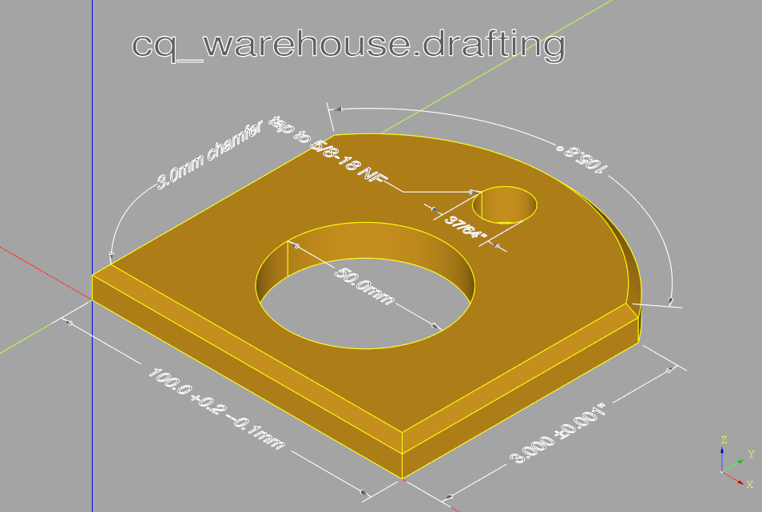

#################################
drafting - model-based definition
#################################
A class used to document cadquery designs by providing three methods that place
the dimensions and notes right on the 3D model.

For example:

.. code-block:: python

	import cadquery as cq
	from cq_warehouse.drafting import Draft

	# Import an object to be dimensioned
	mystery_object = cq.importers.importStep("mystery.step")

	# Create drawing instance with appropriate settings
	metric_drawing = Draft(decimal_precision=1)

	# Create an extension line from corners of the part
	length_dimension_line = metric_drawing.extension_line(
	    object_edge=mystery_object.faces("<Z").vertices("<Y").vals(),
	    offset=10.0,
	    tolerance=(+0.2, -0.1),
	)

	if "show_object" in locals():
	    show_object(mystery_object, name="mystery_object")
	    show_object(length_dimension_line, name="length_dimension_line")

To illustrate some of the capabilities of the drafting package, a set of
dimension lines, extension lines and callouts were applied to a CadQuery part
with no prior knowledge of any of the dimensions:

One could define three instances of the Draft class, one for each of the XY, XZ
and YZ planes and generate a set of dimensions on each one. By enabling one of
these planes at a time and exporting svg images traditional drafting documents
can be generated.

When generating dimension lines there are three possibilities depending on the
measurement and Draft attributes (described below):

#. The label text (possibly including units and tolerances) and arrows fit within the measurement,
#. The label text but not the arrows fit within the measurement, or
#. Neither the text nor the arrows fit within the measurements.

Cases 1 and 2 are shown in the above example. In case 3, the label will be attached to one of the external arrows.

These three possibilities are illustrated below with both linear and arc extension lines:

.. image:: drafting_types.png
	:alt: drafting

Note that type 3b can only be created by disabling the end arrow - see the arrows parameter below.

To help ease use, a new CadQuery type called ``PathDescriptor`` has been created which is defined as:
``Union[Wire, Edge, list[Union[Vector, Vertex, tuple[float, float, float]]]`` i.e. a list of points or
CadQuery edge or wire either extracted from a part or created by the user.

The Draft class contains a set of attributes used to describe subsequent
dimension_line(s), extension_line(s) or callout(s). The full list is as follows:

.. py:module:: drafting

.. autoclass:: Draft
	:members: dimension_line, extension_line, callout
