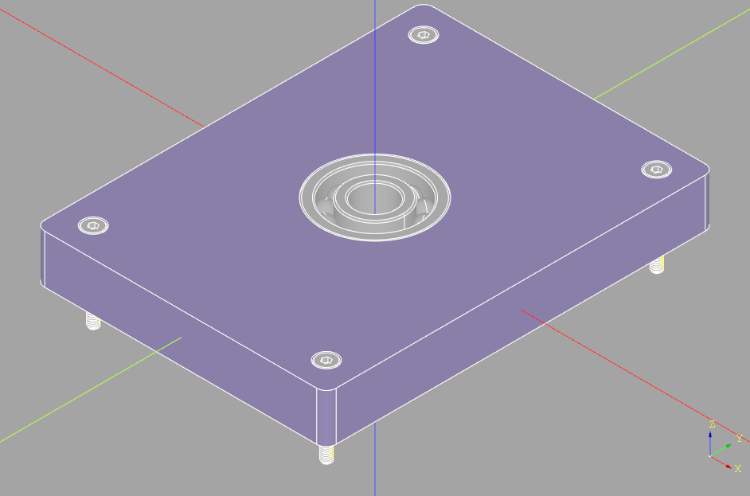
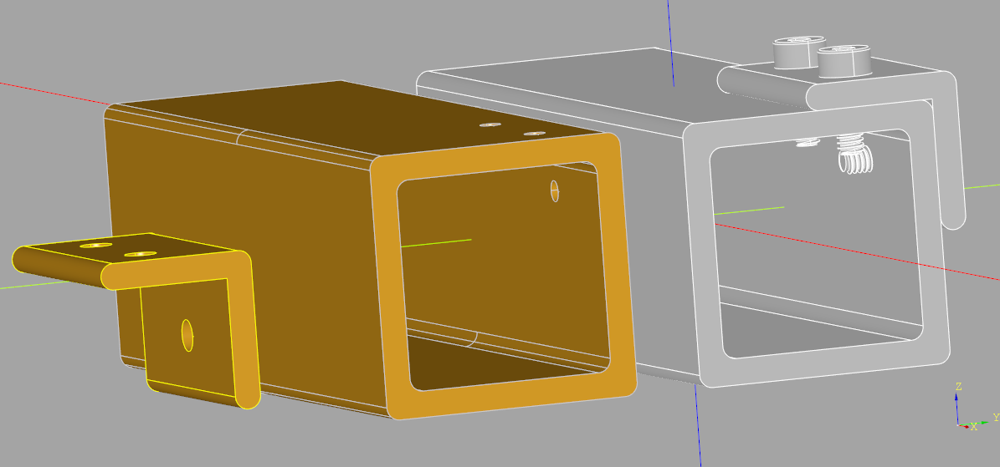

########################################
fastener - parametric threaded fasteners
########################################
Many mechanical designs will contain threaded fasteners of some kind, either in a
threaded hole or threaded screws or bolts holding two or more parts together. The
fastener sub-package provides a set of classes with which raw threads can be created
such that they can be integrated into other parts as well as a set of classes that
create many different types of nuts, screws and washers - as follows:

.. image:: fastener_disc.png
	:alt: fastener_disc

The holes for the screws in this figure were created with an extension of the Workplane
class :meth:`~extensions_doc.Workplane.clearanceHole`, the nuts
:meth:`~extensions_doc.Workplane.tapHole` and the central hole
:meth:`~extensions_doc.Workplane.threadedHole`.
The washers were automatically placed and all components were add to an Assembly in
their correct position and orientations - see
:ref:`Clearance, Tap and Threaded Holes <clearance holes>` for details.

Here is a list of the classes (and fastener types) provided:

* :ref:`Nut <nut>` - the base nut class

  * ``DomedCapNut``: din1587
  * ``HexNut``: iso4033, iso4035, iso4032
  * ``HexNutWithFlange``: din1665
  * ``UnchamferedHexagonNut``: iso4036
  * ``SquareNut``: din557

* :ref:`Screw <screw>` - the base screw class

  * ``ButtonHeadScrew``: iso7380_1
  * ``ButtonHeadWithCollarScrew``: iso7380_2
  * ``CheeseHeadScrew``: iso14580, iso7048, iso1207
  * ``CounterSunkScrew``: iso2009, iso14582, iso14581, iso10642, iso7046
  * ``HexHeadScrew``: iso4017, din931, iso4014
  * ``HexHeadWithFlangeScrew``: din1662, din1665
  * ``PanHeadScrew``: asme_b_18.6.3, iso1580, iso14583
  * ``PanHeadWithCollarScrew``: din967
  * ``RaisedCheeseHeadScrew``: iso7045
  * ``RaisedCounterSunkOvalHeadScrew``: iso2010, iso7047, iso14584
  * ``SetScrew``: iso4026
  * ``SocketHeadCapScrew``: iso4762, asme_b18.3

* :ref:`Washer <washer>` - the base washer class

  * ``PlainWasher``: iso7094, iso7093, iso7089, iso7091
  * ``ChamferedWasher``: iso7090
  * ``CheeseHeadWasher``: iso7092

See :ref:`Extending the fastener sub-package <extending>` for guidance on how to easily
add new sizes or entirely new types of fasteners.

 The following example creates a variety of different sized fasteners:

.. code-block:: python

	import cadquery as cq
	from cq_warehouse.fastener import HexNut, SocketHeadCapScrew, SetScrew
	MM = 1
	IN = 25.4 * MM

	nut = HexNut(size="M3-0.5", fastener_type="iso4032")
	setscrew = SetScrew(size="M6-1", fastener_type="iso4026",length=10 * MM)
	capscrew = SocketHeadCapScrew(size="#6-32", fastener_type="asme_b18.3", length=(1/2) * IN)

Both metric and imperial sized standard fasteners are directly supported by the fastener sub-package
although the majority of the fasteners currently implemented are metric.

Many of the fastener standards provide ranges for some of the dimensions - for example a minimum and
maximum head diameter. This sub-package generally uses the maximum sizes when a range is available
in-order to ensure clearance between a fastener and another part won't be compromised by a physical
part that is within specification but larger than the CAD model.

Threaded parts are complex for CAD systems to create and significantly increase the storage requirements
thus making the system slow and difficult to use. To minimize these requirements all of the fastener
classes have a ``simple`` boolean parameter that when ``True`` doesn't create actual threads at all.
Such simple parts have the same overall dimensions and such that they can be used to check for fitment
without dramatically impacting performance.

.. hint::

	⌛CQ-editor⌛ You can increase the Preferences→3D Viewer→Deviation parameter to improve performance
	by slightly compromising accuracy.

All of the fasteners default to right-handed thread but each of them provide a ``hand`` string
parameter which can either be ``"right"`` or ``"left"``.

All of the fastener classes provide a ``cq_object`` instance variable which contains the cadquery
object.

The following sections describe each of the provided classes.

.. _nut:

***
Nut
***
As the base class of all other nut and bolt classes, all of the derived nut classes share the same
interface as follows:

.. autoclass:: fastener.Nut

Nut Selection
=============
As there are many classes and types of nuts to select from, the Nut class provides some methods
that can help find the correct nut for your application. As a reminder, to find the subclasses of
the Nut class, use ``__subclasses__()``:

.. py:module:: fastener

.. doctest::

   	>>> Nut.__subclasses__()
	[<class 'cq_warehouse.fastener.DomedCapNut'>, ...]

Here is a summary of the class methods:

.. automethod:: Nut.types

.. doctest::

	>>> HexNut.types()
	{'iso4033', 'iso4032', 'iso4035'}

.. automethod:: Nut.sizes

.. doctest::

	>>> HexNut.sizes("iso4033")
	['M1.6-0.35', 'M1.8-0.35', 'M2-0.4', 'M2.5-0.45', 'M3-0.45', 'M3.5-0.6', 'M4-0.7', 'M5-0.8', 'M6-1', 'M8-1.25', 'M10-1.5', 'M12-1.75', 'M14-2', 'M16-2', 'M18-2.5', 'M20-2.5', 'M22-2.5', 'M24-3', 'M27-3', 'M30-3.5', 'M33-3.5', 'M36-4', 'M39-4', 'M42-4.5', 'M45-4.5', 'M48-5', 'M52-5']

.. automethod:: Nut.select_by_size

.. doctest::

	>>> Nut.select_by_size("M6-1")
	{<class 'cq_warehouse.fastener.DomedCapNut'>: ['din1587'], <class 'cq_warehouse.fastener.HexNut'>: ['iso4035', 'iso4032', 'iso4033'], <class 'cq_warehouse.fastener.HexNutWithFlange'>: ['din1665'], <class 'cq_warehouse.fastener.UnchamferedHexagonNut'>: ['iso4036'], <class 'cq_warehouse.fastener.SquareNut'>: ['din557']}

Derived Nut Classes
===================
The following is a list of the current nut classes derived from the base Nut class. Also listed is
the type for each of these derived classes where the type refers to a standard that defines the nut
parameters. All derived nuts inherit the same API as the base Nut class.

* ``DomedCapNut``: din1587
* ``HexNut``: iso4033, iso4035, iso4032
* ``HexNutWithFlange``: din1665
* ``UnchamferedHexagonNut``: iso4036
* ``SquareNut``: din557

Detailed information about any of the nut types can be readily found on the internet from manufacture's
websites or from the standard document itself.

.. _screw:

*****
Screw
*****
As the base class of all other screw and bolt classes, all of the derived screw classes share the same
interface as follows:

.. autoclass:: fastener.Screw

The following method helps with hole creation:

.. automethod:: Screw.min_hole_depth

Screw Selection
===============
As there are many classes and types of screws to select from, the Screw class provides some methods that
can help find the correct screw for your application. As a reminder, to find the subclasses of the
Screw class, use ``__subclasses__()``:

.. doctest::

   	>>> Screw.__subclasses__()
	[<class 'cq_warehouse.fastener.ButtonHeadScrew'>, ...]

Here is a summary of the class methods:

.. automethod:: Screw.types

.. doctest::

	>>> CounterSunkScrew.types()
	{'iso14582', 'iso10642', 'iso14581', 'iso2009', 'iso7046'}

.. automethod:: Screw.sizes

.. doctest::

	>>> CounterSunkScrew.sizes("iso7046")
	['M1.6-0.35', 'M2-0.4', 'M2.5-0.45', 'M3-0.5', 'M3.5-0.6', 'M4-0.7', 'M5-0.8', 'M6-1', 'M8-1.25', 'M10-1.5']

.. automethod:: Screw.select_by_size

* ``select_by_size(size:str)`` : (dict{class:[type,...],} - e.g.:

.. doctest::

	>>> Screw.select_by_size("M6-1")
	{<class 'cq_warehouse.fastener.ButtonHeadScrew'>: ['iso7380_1'], <class 'cq_warehouse.fastener.ButtonHeadWithCollarScrew'>: ['iso7380_2'], ...}

To see if a given screw type has screws in the length you are looking for, each screw class
provides a dictionary of available lengths, as follows:

.. doctest::

	>>> CounterSunkScrew.nominal_length_range["iso7046"]
	[3.0, 4.0, 5.0, 6.0, 8.0, 10.0, 12.0, 14.0, 16.0, 20.0, 25.0, 30.0, 35.0, 40.0, 45.0, 50.0, 55.0, 60.0]

During instantiation of a screw any value of ``length`` may be used; however, only a subset of
the above nominal_length_range is valid for any given screw size. The valid sub-range is given
with the ``nominal_lengths`` property as follows:

.. doctest::

	>>> screw = CounterSunkScrew(fastener_type="iso7046",size="M6-1",length=12 * MM)
	>>> screw.nominal_lengths
	[8.0, 10.0, 12.0, 14.0, 16.0, 20.0, 25.0, 30.0, 35.0, 40.0, 45.0, 50.0, 55.0, 60.0]

Derived Screw Classes
=====================
The following is a list of the current screw classes derived from the base Screw class. Also listed
is the type for each of these derived classes where the type refers to a standard that defines the
screw parameters. All derived screws inherit the same API as the base Screw class.

* ``ButtonHeadScrew``: iso7380_1
* ``ButtonHeadWithCollarScrew``: iso7380_2
* ``CheeseHeadScrew``: iso14580, iso7048, iso1207
* ``CounterSunkScrew``: iso2009, iso14582, iso14581, iso10642, iso7046
* ``HexHeadScrew``: iso4017, din931, iso4014
* ``HexHeadWithFlangeScrew``: din1662, din1665
* ``PanHeadScrew``: asme_b_18.6.3, iso1580, iso14583
* ``PanHeadWithCollarScrew``: din967
* ``RaisedCheeseHeadScrew``: iso7045
* ``RaisedCounterSunkOvalHeadScrew``: iso2010, iso7047, iso14584
* ``SetScrew``: iso4026
* ``SocketHeadCapScrew``: iso4762, asme_b18.3

Detailed information about any of the screw types can be readily found on the internet from manufacture's
websites or from the standard document itself.

.. _washer:

******
Washer
******
As the base class of all other washer and bolt classes, all of the derived washer classes share
the same interface as follows:

.. autoclass:: fastener.Washer

Washer Selection
================
As there are many classes and types of washers to select from, the Washer class provides some methods
that can help find the correct washer for your application. As a reminder, to find the subclasses of
the Washer class, use ``__subclasses__()``:

.. doctest::

	>>> Washer.__subclasses__()
	[<class 'cq_warehouse.fastener.PlainWasher'>, <class 'cq_warehouse.fastener.ChamferedWasher'>, <class 'cq_warehouse.fastener.CheeseHeadWasher'>]

Here is a summary of the class methods:

.. automethod:: Washer.types

.. doctest::

	>>> PlainWasher.types()
	{'iso7091', 'iso7089', 'iso7093', 'iso7094'}

.. automethod:: Washer.sizes

.. doctest::

	>>> PlainWasher.sizes("iso7091")
	['M1.6', 'M1.7', 'M2', 'M2.3', 'M2.5', 'M2.6', 'M3', 'M3.5', 'M4', 'M5', 'M6', 'M7', 'M8', 'M10', 'M12', 'M14', 'M16', 'M18', 'M20', 'M22', 'M24', 'M26', 'M27', 'M28', 'M30', 'M32', 'M33', 'M35', 'M36']

.. automethod:: Washer.select_by_size

.. doctest::

	>>> Washer.select_by_size("M6")
	{<class 'cq_warehouse.fastener.PlainWasher'>: ['iso7094', 'iso7093', 'iso7089', 'iso7091'], <class 'cq_warehouse.fastener.ChamferedWasher'>: ['iso7090'], <class 'cq_warehouse.fastener.CheeseHeadWasher'>: ['iso7092']}

Derived Washer Classes
======================
The following is a list of the current washer classes derived from the base Washer class. Also listed
is the type for each of these derived classes where the type refers to a standard that defines the washer
parameters. All derived washers inherit the same API as the base Washer class.

* ``PlainWasher``: iso7094, iso7093, iso7089, iso7091
* ``ChamferedWasher``: iso7090
* ``CheeseHeadWasher``: iso7092

Detailed information about any of the washer types can be readily found on the internet from manufacture's
websites or from the standard document itself.

.. _clearance holes:

*********************************
Clearance, Tap and Threaded Holes
*********************************
When designing parts with CadQuery a common operation is to place holes appropriate to a specific fastener
into the part. This operation is optimized with cq_warehouse by the following three new Workplane methods:

* :meth:`~extensions_doc.Workplane.clearanceHole`,
* :meth:`~extensions_doc.Workplane.tapHole`, and
* :meth:`~extensions_doc.Workplane.threadedHole`.

The API for all three methods are very similar. The ``fit`` parameter is used
for clearance hole dimensions and to calculate the gap around the head of a countersunk screw.
The ``material`` parameter controls the size of the tap hole as they differ as a function of the
material the part is made of. For clearance and tap holes, ``depth`` values of ``None`` are treated
as thru holes. The threaded hole method requires that ``depth`` be specified as a consequence of
how the thread is constructed.

These methods use data provided by a fastener instance (either a ``Nut`` or a ``Screw``) to both create
the appropriate hole (possibly countersunk) in your part as well as add the fastener to a CadQuery Assembly
in the location of the hole. In addition, a list of washers can be provided which will get placed under the
head of the screw or nut in the provided Assembly.

For example, let's re-build the parametric bearing pillow block found in
the `CadQuery Quickstart <https://cadquery.readthedocs.io/en/latest/quickstart.html>`_:

.. code-block:: python

	import cadquery as cq
	from cq_warehouse.fastener import SocketHeadCapScrew

	height = 60.0
	width = 80.0
	thickness = 10.0
	diameter = 22.0
	padding = 12.0

	# make the screw
	screw = SocketHeadCapScrew(fastener_type="iso4762", size="M2-0.4", length=16, simple=False)
	# make the assembly
	pillow_block = cq.Assembly(None, name="pillow_block")
	# make the base
	base = (
	    cq.Workplane("XY")
	    .box(height, width, thickness)
	    .faces(">Z")
	    .workplane()
	    .hole(diameter)
	    .faces(">Z")
	    .workplane()
	    .rect(height - padding, width - padding, forConstruction=True)
	    .vertices()
	    .clearanceHole(fastener=screw, baseAssembly=pillow_block)
	    .edges("|Z")
	)
	pillow_block.add(base)
	# Render the assembly
	show_object(pillow_block)

Which results in:

The differences between this code and the Read the Docs version are:

* screw dimensions aren't required
* the screw is created during instantiation of the ``SocketHeadCapScrew`` class
* an assembly is created and later the base is added to that assembly
* the call to cskHole is replaced with clearanceHole

Not only were the appropriate holes for M2-0.4 screws created but an assembly was created to
store all of the parts in this project all without having to research the dimensions of M2 screws.

Note: In this example the ``simple=False`` parameter creates accurate threads on each of the
screws which significantly increases the complexity of the model. The default of simple is True
which models the thread as a simple cylinder which is sufficient for most applications without
the performance cost of accurate threads. Also note that the default color of the pillow block
"base" was changed to better contrast the screws.

The data used in the creation of these holes is available via three instance methods:

.. doctest::

	>>> screw = CounterSunkScrew(fastener_type="iso7046", size="M6-1", length=10)
	>>> screw.clearance_hole_diameters
	{'Close': 6.4, 'Normal': 6.6, 'Loose': 7.0}

	>>> screw.clearance_drill_sizes
	{'Close': '6.4', 'Normal': '6.6', 'Loose': '7'}
	>>> screw.tap_hole_diameters
	{'Soft': 5.0, 'Hard': 5.4}
	>>> screw.tap_drill_sizes
	{'Soft': '5', 'Hard': '5.4'}

Note that with imperial sized holes (e.g. 7/16), the drill sizes could be a fractional size (e.g. 25/64)
or a numbered or lettered size (e.g. U). This information can be added to your designs with the
:ref:`drafting <drafting>` sub-package.

******************
Fastener Locations
******************
There are two methods that assist with the location of fastener holes relative to other
parts: :meth:`~extensions_doc.Assembly.fastenerLocations` and :meth:`~extensions_doc.Workplane.pushFastenerLocations`.

The `align_fastener_holes.py <https://github.com/gumyr/cq_warehouse/blob/main/examples/align_fastener_holes.py>`_
example shows how these methods can be used to align holes between parts in an assembly.

.. literalinclude:: ../examples/align_fastener_holes.py
   :language: python

.. doctest::

	((25.0, 5.0, 12.0), (0.0, -0.0, 0.0))
	((15.0, 5.0, 12.0), (0.0, -0.0, 0.0))
	((20.0, 12.0, 5.0), (1.5707963267948966, -0.0, 3.141592653589793))
	{'SocketHeadCapScrew(iso4762): M2-0.4x6': 3}

*****************
Bill of Materials
*****************
As previously mentioned, when an assembly is passed into the three hole methods the fasteners
referenced are added to the assembly. A new method has been added to the CadQuery Assembly
class - :meth:`~extensions_doc.Assembly.fastenerQuantities` - which scans the assembly and returns a dictionary of either:

* {fastener: count}, or
* {fastener.info: count}

For example, the values for the previous pillow block example are:

.. doctest::

	>>> print(pillow_block.fastenerQuantities())
	{'SocketHeadCapScrew(iso4762): M2-0.4x16': 4}

	>>> print(pillow_block.fastenerQuantities(bom=False))
	{<cq_warehouse.fastener.SocketHeadCapScrew object at 0x7f90560f3a90>: 4}

Note that this method scans the given assembly and all its children for fasteners. To limit the
scan to just the current Assembly, set the ``deep=False`` optional parameter).

.. _extending:

**********************************
Extending the fastener sub-package
**********************************
The fastener sub-package has been designed to be extended in the following two ways:

Alternate Sizes
===============
As mentioned previously, the data used to guide the creation of fastener objects is derived
from ``.csv`` files found in the same place as the source code. One can add to the set of standard
sized fasteners by inserting appropriate data into the tables. There is a table for each fastener
class; an example of the 'socket_head_cap_parameters.csv' is below:

+------------+------------+-----------+-----+---------------+--------------+-----+--------------+
| Size       | iso4762:dk | iso4762:k | ... | asme_b18.3:dk | asme_b18.3:k |     | asme_b18.3:s |
+============+============+===========+=====+===============+==============+=====+==============+
| M2-0.4     | 3.98       | 2         |     |               |              |     |              |
+------------+------------+-----------+-----+---------------+--------------+-----+--------------+
| M2.5-0.45  | 4.68       | 2.5       |     | 0.096         | 0.06         |     | 0.05         |
+------------+------------+-----------+-----+---------------+--------------+-----+--------------+
| M3-0.5     | 5.68       | 3         |     | 0.118         | 0.073        |     | 1/16         |
+------------+------------+-----------+-----+---------------+--------------+-----+--------------+
| ...        |            |           |     | 0.118         | 0.073        |     | 1/16         |
+------------+------------+-----------+-----+---------------+--------------+-----+--------------+
| #0-80      |            |           |     | 0.14          | 0.086        |     | 5/64         |
+------------+------------+-----------+-----+---------------+--------------+-----+--------------+
| #1-64      |            |           |     |               |              |     |              |
+------------+------------+-----------+-----+---------------+--------------+-----+--------------+
| #1-72      |            |           |     |               |              |     |              |
+------------+------------+-----------+-----+---------------+--------------+-----+--------------+
| #2-56      |            |           |     |               |              |     |              |
+------------+------------+-----------+-----+---------------+--------------+-----+--------------+

The first row must contain a 'Size' and a set of '{fastener_type}:{parameter}'
values. The parameters are taken from the ISO standards where 'k' represents the
head height of a screw head, 'dk' is represents the head diameter, etc. Refer to
the appropriate document for a complete description. The fastener 'Size' field
has the format 'M{thread major diameter}-{thread pitch}' for metric fasteners or
either '#{guage}-{TPI}' or '{fractional major diameter}-{TPI}' for imperial
fasteners (TPI refers to Threads Per Inch). All the data for imperial fasteners
must be entered as inch dimensions while metric data is in millimeters.

There is also a 'nominal_screw_lengths.csv' file that contains a list of all the
lengths supported by the standard, as follows:

+------------+------+--------------------------+
| Screw_Type | Unit | Nominal_Sizes            |
+============+======+==========================+
| din931     | mm   | 30,35,40,45,50,55,60,... |
+------------+------+--------------------------+
| ...        |      |                          |
+------------+------+--------------------------+

The 'short' and 'long' values from the first table (not shown) control the
minimum and maximum values in the nominal length ranges for each screw.

New Fastener Types
==================
The base/derived class structure was designed to allow the creation of new
fastener types/classes. For new fastener classes a 2D drawing of one half of the
fastener profile is required. If the fastener has a non circular plan (e.g. a
hex or a square) a 2D drawing of the plan is required. If the fastener contains
a flange and a plan, a 2D profile of the flange is required. If these profiles
or plans are present, the base class will use them to build the fastener. The
Abstract Base Class technology ensures derived classes can't be created with
missing components.
