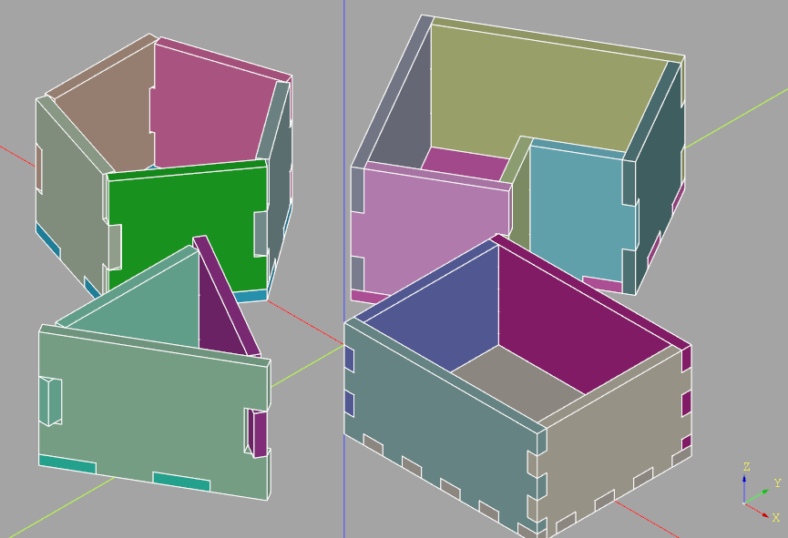
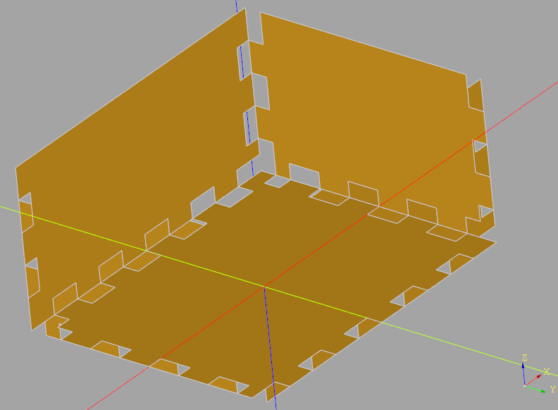

#################################
extensions - finger jointed boxes
#################################
CNC controlled laser cutters have enabled the creation of inexpensive finger jointed
boxes constructed from many materials. However, the creation of the patterns to feed
into the laser can be quite time consuming. The finger jointed boxes methods within
the cq_warehouse extensions package allow the creation of these patterns from a simple
solid object.

*****
Usage
*****
To create these boxes, one just needs to create the solid object, select edges, and use the
:meth:`~extensions_doc.Workplane.makeFingerJoints` method, as follows:

.. literalinclude:: ../examples/finger_jointed_boxes.py
   :language: python

.. doctest::

	>>> polygon_box_assembly.areObjectsValid()
	True
	>>> polygon_box_assembly.doObjectsIntersect()
	False

.. warning::
    Not all shapes will result in a valid set of finger jointed box patterns.

    Although the goal of this package is to enable the creation of a finger jointed
    box from any object with planar faces, this goal has not been fully achieved.
    Carefully inspect the output to ensure it is correct before cutting boxes
    to avoid disappointment.

The Workplane used to create a finger jointed box must contain a solid object
(actually a Solid or Compound object), and one or more Edges that is to be jointed.
In the above example, all of the edges are selected except for those on the top
of the object which results in an open box. The resulting faces can be further
modified if required.

Here is an example of finger jointed faces of a simple box:

Notice how the finger joints on the nearest corner are in a different pattern than
the simple fingers on the other parts of the box? This is done to avoid the
creation of a missing corner.

Finger joint size is calculated internally such that an integer number of finger joints
are present on each edge - i.e. if the ``targetFingerWidth`` would result in a partial
finger joint, the actual finger joint width will reduced such the number of finger
joints is rounded to an integer.  This may result in finger joints on different
edges being different sizes.

The use of an Assembly is optional but is recommended to aid in the visual validation
of the output. Random colors are assigned to each of the box walls to aid this
validation. Corners are where errors are most likely to appear, either as interference
or as missing corners.

When working with shapes with non perpendicular faces (i.e. faces that don't meet at
90˚) the depth of the finger joint is calculated to compensate for the angle by either
making the joint extra deep (for angles greater than 90˚) or smaller (for angles less than 90˚).
Unfortunately, not all possible combinations of corner angles have been compensated for
so pay extra care when inspecting these corners.

The result of the :meth:`~extensions_doc.Workplane.makeFingerJoints` method is a set of
Faces within the Workplane aligned with the original solid object. To store these faces
as DXF files it is necessary to create a workplane oriented in the same way as the face
as shown in the above example.

The full API is as follows:

.. py:module:: extensions_doc
    :noindex:

.. automethod:: Workplane.makeFingerJoints
    :noindex:

The ``kerfWidth`` parameter can be used to compensate for the size of the laser cut
thus allowing a path for the laser to the created directly from the face. Check with
the manufacturer to see if this compensation is required.

**********
Validation
**********
To help validate the finger jointed box two Assembly methods are available:

* :meth:`~extensions_doc.Assembly.areObjectsValid`
* :meth:`~extensions_doc.Assembly.doObjectsIntersect`

Checking for intersecting objects within the Assembly (a general purpose method where every
pair of objects within the Assembly - in their given Location - are checked for an intersection)
will identify if there are overlapping finger joints but will not find missing fingers. To check
for missing corners, one can use the ``Volume`` method as follows:

.. code-block:: python

    import cadquery as cq
    import cq_warehouse.extensions

    simple_box_assembly = Assembly()
    simple_box = Workplane("XY").box(100, 80, 50)
    simple_box_volume = simple_box.faces(">Z").shell(-5, kind="intersection").val().Volume()
    simple_box_faces = (
        simple_box.edges("not >Z").makeFingerJoints(
            materialThickness=5,
            targetFingerWidth=10,
            baseAssembly=simple_box_assembly,
        )
    )
    simple_box_assembly_volume_error = abs(
        simple_box_assembly.toCompound().Volume() - simple_box_volume
    )
    print(f"Is volume correct: {simple_box_assembly_volume_error<1e-5=}")

