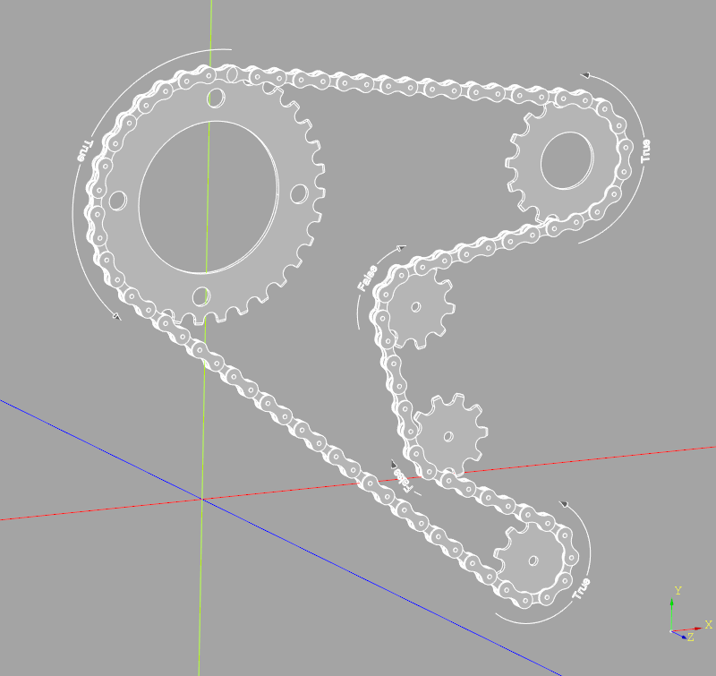

# Chain

This python/cadquery code is a parameterized chain generator.
Once provided with a few parameters a CAD model is generated which
can be easily saved in STEP or STL format for use in a wide variety of CAD
or CAM systems. Cadquery programmers can add further detail to the resulting
Assembly objects by add them to larger cadquery projects.

## Table of Contents
- [Chain](#chain)
  - [Table of Contents](#table-of-contents)
  - [Installation](#installation)
    - [Requirements](#requirements)
  - [Chain Class](#chain-class)
    - [Input Parameters](#input-parameters)
    - [Instance Variables](#instance-variables)
    - [Methods](#methods)
  - [Future Enhancements](#future-enhancements)
## Installation
TBD...
Install directly from github:
```
  $ git clone https://github.com/gumyr/Velomobile/tree/master/sprocketsAndChain
  $ cd
  $ python setup.py install
```
### Requirements
You need cadquery master to run sprocket_and_chain.

## Chain Class
A chain wrapped around a set of sprockets can be generated with the `Chain` class by providing
the size and locations of the sprockets, how the chain wraps and optionally the chain parameters.

For example, one can create the chain for a bicycle with a rear deraileur as follows:
```python
derailleur_chain = Chain(
    spkt_teeth=[32,10,10,16],
    positive_chain_wrap=[True,True,False,True],
    spkt_locations=[
        (0,158.9*MM,50*MM),
        (+190*MM,0,50*MM),
        (+190*MM,78.9*MM,50*MM),
        (+205*MM,158.9*MM,50*MM)
    ]
)
```
### Input Parameters
The complete set of inputs parameters are:
```python
spkt_teeth : list of int
    """ a list of the number of teeth on each sprocket the chain will wrap around """
spkt_locations : list of cq.Vector or tuple(x,y) or tuple(x,y,z)
    """ the location of the sprocket centers """
positive_chain_wrap : list of bool
    """ the direction chain wraps around the sprockets, True for counter clock wise viewed from positive Z """
chain_pitch : float
    """ the distance between two adjacent pins in a single link (default 1/2 INCH) """
roller_diameter : float
    """ the size of the cylindrical rollers within the chain (default 5/16 INCH) """
roller_length : float
    """ the distance between the inner links, i.e. the length of the link rollers """
link_plate_thickness : float
    """ the thickness of the link plates (both inner and outer link plates) """
```
The chain is created on the XY plane (methods to move the chain are described below)
with the sprocket centers being described by:
- a two dimensional tuple (x,y)
- a three dimensional tuple (x,y,z) which will result in the chain being created parallel
to the XY plane, offset by <q>z</q>
- the cadquery Vector class which will displace the chain by Vector.z

To control the path of the chain between the sprockets, the user must indicate the desired
direction for the chain to wrap around the sprocket. This is done with the `positive_chain_wrap`
parameter which is a list of boolean values - one for each sprocket - indicating a counter
clock wise or positive angle around the z-axis when viewed from the positive side of the XY
plane. The following diagram illustrates the most complex chain path where the chain
traverses wraps from positive to positive, positive to negative, negative to positive and
negative to negative directions (`positive_chain_wrap` values are shown within the arrows
starting from the largest sprocket):



Note that the chain is perfectly tight as it wraps around the sprockets and
does not support any slack. Therefore, as the chain wraps back around to the
first link it will either overlap or gap this link - this can be seen in the above
figure at the top of the largest sprocket. To control this,
the length of the chain in links is echoed to the console window and should
have a small fractional value.  For example, 72.0037 is the value resulting
from the default customizer values which results in a near perfect fit.  A
value of 72.7 would result in a noticeable gap. Adjust the locations of the
sprockets to control this value.

### Instance Variables
In addition to all of the input parameters that are stored as instance variables
within the Chain instance there are seven derived instance variables:

```python
pitch_radii : list of float
    """ the radius of the circle formed by the center of the chain rollers on each sprocket """
chain_links : float
    """ the length of the chain in links """
num_rollers : int
    """ the number of link rollers in the entire chain """
roller_loc : list of cq.Vector
    """ the location of each roller in the chain """
chain_angles : list of tuple(float,float)
    """ the chain entry and exit angles in degrees for each sprocket """
spkt_initial_rotation : list of float
    """ a in degrees to rotate each sprocket in-order to align the teeth with the gaps in the chain """
cq_object : cq.Assembly
    """ the cadquery chain object """
```
### Methods
The Chain class defines two methods:
- a static method used to generate chain links cadquery objects, and
- an instance method that will build a cadquery assembly for a chain given a set of sprocket
cadquery objects.
Note that the make_link instance method uses the @cache decorator to greatly improve the rate at
links can be generated as a chain is composed of many copies of the links.

```python
def assemble_chain_transmission(self,spkts:list[Union[cq.Solid,cq.Workplane]]) -> cq.Assembly:
    """
    Create the transmission assembly from sprockets for a chain

    Parameters
    ----------
    spkts : list of cq.Solid or cq:Workplane
        the sprocket cadquery objects to combine with the chain to build a transmission
    """

@staticmethod
@cache
def make_link(
        chain_pitch:float = 0.5*INCH,
        link_plate_thickness:float = 1*MM,
        inner:bool = True,
        roller_length:float = (3/32)*INCH,
        roller_diameter:float = (5/16)*INCH
    ) -> cq.Workplane:
    """
    Create either inner or outer link pairs.  Inner links include rollers while
    outer links include fake roller pins.

    Parameters
    ----------
    chain_pitch : float = (1/2)*INCH
        # the distance between the centers of two adjacent rollers
    link_plate_thickness : float = 1*MM
        # the thickness of the plates which compose the chain links
    inner : bool = True
        # inner links include rollers while outer links include roller pins
    roller_length : float = (3/32)*INCH,
        # the spacing between the inner link plates
    roller_diameter : float = (5/16)*INCH
        # the size of the cylindrical rollers within the chain
    """
```
In addition to the Chain methods, two additional methods are added to the cq.Assembly class
which allow easy manipulation of the resulting chain cadquery objects, as follows:
```python
cq.Assembly.translate(self, vec: VectorLike):
    """
    Moves the current assembly (without making a copy) by the specified translation vector

    Parameters
    ----------
    vec : cq.Vector or tuple(x,y) or tuple(x,y,z)
        The translation vector
    """

cq.Assembly.rotate(self, axis: VectorLike, angle: float):
    """
    Rotates the current assembly (without making a copy) around the axis of rotation
    by the specified angle

    Parameters
    ----------
    axis : cq.Vector or tuple(x,y,z)
        The axis of rotation (starting at the origin)
    angle : float
        the rotation angle, in degrees
    """
```
Once a chain or complete transmission has been generated it can be re-oriented as follows:
```python
relocated_transmission = relocated_transmission.assemble_chain_transmission(
    spkts = [spkt0.cq_object,spkt0.cq_object]
).rotate(axis=(0,1,1),angle=45).translate((20,20,20))
```
## Future Enhancements
Two future enchancments are being considered:
1. Non-planar chains - If the sprocket centers contain `z` values, the
chain would follow the path of a spline between the sockets to approximate
the path of a bicycle chain where the front and read sprockets are not
in the same plane. Currently, the `z` values of the first sprocket defind
the `z` offset of the entire chain.
2. Sprocket Location Slots - Typically on or more of the sprockets in a chain
transmission will be adjustable to allow the chain to be tight around the
sprockets. This could be implemented by allowing the user to specify a pair
of locations defining a slot for a given sprocket indicating that the sprocket
location should be selected somewhere along this slot to create a perfectly
fitting chain.